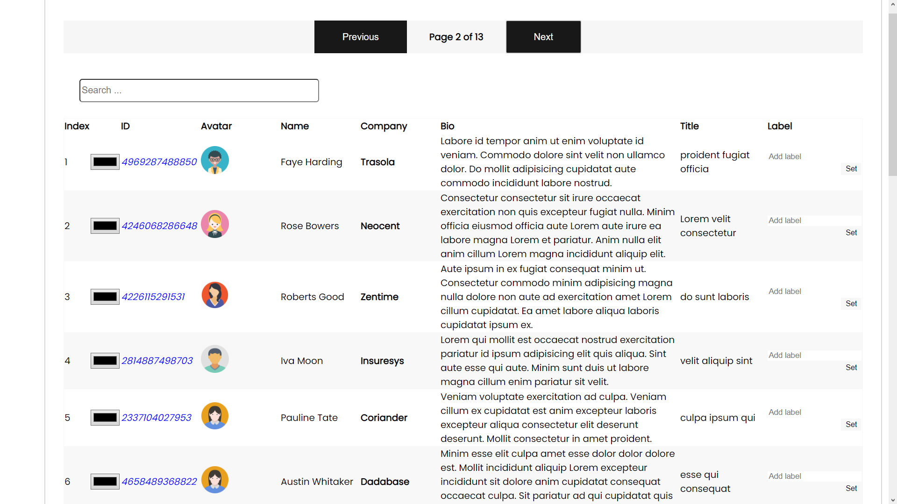

# Employees Table
To start the apllication, please follow the next two steps

### `npm install`
### `npm run dev`
    
-  Use pagination to display 20 items per page 
-  Implement functionality to expand each avatar image to full size/fit screen
-  Add a dropdown menu to each list item which allows the user to select a background color for the corresponding list item. 
-  Add a text input to each list item which allows the user to enter a label for the corresponding item. 
-  Add a text input to the page which allows the user to filter the listed items by the label data entered through the input that you implemented in task   4 
-  Persist the added background color and label data after page refresh

# Tech
- React ( React Hooks, Styled Components)
- Node.js

